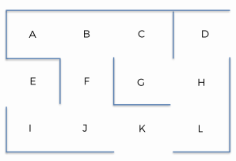

# Artificial Intelligence Pathfinder

### Goal:  
Develop a Q-Learning AI algorithm that can find the shortest distance between any two areas in this environment:  

### Description:  
This project uses reinforcement learning tehcniques to calculate the best path between a start and end point in a virtual "warehouse".  
This process could be used to automate bots in a warehouse to carry items between two points, thus cutting costs by optimizing the logistical processes.  

### Links:  
[Code Notebook](/ai_pathfinder.ipynb)  